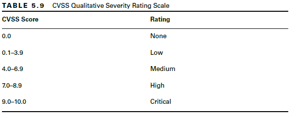

[🏠 Main Site](https://motasem-notes.net/) · [🛒 Store](https://shop.motasem-notes.net/) · [▶ YouTube](https://www.youtube.com/@MotasemHamdan) · [☕ Membership](https://buymeacoffee.com/notescatalog/membership)

> Practitioner-grade cybersecurity notes, cert prep guides, and courses. All premium notes available at **[buymeacoffee.com/notescatalog/extras](https://buymeacoffee.com/notescatalog/extras)** or [shop.motasem-notes.net](https://shop.motasem-notes.net)

You can also get this in PDF format for [FREE](https://buymeacoffee.com/notescatalog/e/290985)

## Introduction
This E-book is intended to introduce you to the world of Cyber security by providing brief introduction of key information security concepts & definitions for the purpose of equipping you with the basics if you wish to take this knowledge further and learn more advanced and more specialized knowledge in the domain of information security.
## Cyber Security Basics
### CIA Triad
The 5 Pillars of Information Security are confidentiality, integrity, availability, authenticity, and nonrepudiation. The first three of these, namely confidentiality, integrity, and availability, are so commonly discussed as a group they have been labeled with their own phrase, `the CIA Triad`.
Security controls are typically evaluated on how well they address these three core information security tenets. Vulnerabilities and risks are also evaluated based on the threat they pose against one or more of the CIA Triad principles.
#### Confidentiality
[1]
Confidentiality is the concept of the measures used to ensure the protection of the secrecy of data, objects, or resources. The goal of confidentiality protection is to prevent or minimize unauthorized access to data. Confidentiality protections prevent disclosure while protecting authorized access.
[2]
Numerous countermeasures can help ensure confidentiality against possible threats. These include encryption, network traffic padding, strict access control, rigorous authentication procedures, data classification, and extensive personnel training.
#### Integrity
[1]
Integrity is the concept of protecting the reliability and correctness of data. Integrity protection prevents unauthorized alterations of data. Properly implemented integrity protection provides a means for authorized changes while protecting against intended and malicious unauthorized activities (such as viruses and intrusions) and mistakes made by authorized users (such as accidents or oversights).
[2]
Numerous attacks focus on the violation of integrity. These include viruses, logic bombs, unauthorized access, errors in coding and applications, malicious modification, intentional replacement, and system backdoors. Human error, oversight, or ineptitude accounts for many instances of unauthorized alteration of sensitive information. They can also occur because of an oversight in a security policy or a misconfigured security control.
[3]
Numerous countermeasures can ensure integrity against possible threats. These include strict access control, rigorous authentication procedures, intrusion detection systems, object/data encryption,
hash verifications  interface restrictions, input/function checks, and extensive personnel training.
#### Availability
[1]
Availability includes efficient, uninterrupted access to objects and prevention of denial-of-service (DoS) attacks. Availability also implies that the supporting infrastructure—including network services, communications, and access control mechanisms—is functional and allows authorized users to gain access.
[2]
There are numerous threats to availability. These include device failure, software errors, and environmental issues (heat, static electricity, flooding, power loss, and so on). Some forms of attack focus on the violation of availability, including DoS attacks, object destruction, and communication interruptions.
[3]
Numerous countermeasures can ensure availability against possible threats. These include designing intermediary delivery systems properly, using access controls effectively, monitoring performance and network traffic, using firewalls and routers to prevent DoS attacks, implementing redundancy for critical systems, and maintaining and testing backup systems. Most security policies, as well as business continuity planning (BCP), focus on the use of fault tolerance features at the various levels of access/storage/security (that is, disk, server, or site) with the goal of eliminating single points of failure to maintain the availability of critical systems. 
Availability depends on both integrity and confidentiality. Without integrity and confidentiality, availability cannot be maintained.
#### DAD, Overprotection, Authenticity, Nonrepudiation, and AAA Services
**DAD**
Disclosure, alteration, and destruction make
up the DAD Triad. Triad. The DAD Triad represents the failures of security protections in the CIA Triad.
Disclosure occurs when sensitive or confidential material is accessed by unauthorized entities. It is a violation of confidentiality. Alteration occurs when data is either maliciously or accidentally changed. It is a violation of integrity. Destruction occurs when a resource is damaged or made inaccessible to authorized users (technically, we usually call the latter denial of service [DoS]). Destruction is a violation of availability.
**Overprotection**
Overprotecting confidentiality can result in a restriction of availability. Overprotecting integrity can  result in a restriction of availability. Overproviding availability can result in a loss of confidentiality and integrity.
**Authenticity**
Authenticity is the security concept that data is authentic or genuine and originates from its alleged source. This is related to integrity but more closely related to verifying that it is from a claimed origin.
When data has authenticity, the recipient can have a high level of confidence that the data is from whom it claims to be and did not change in transit (or storage).
**Nonrepudiation**
Nonrepudiation ensures that the subject of an activity or who caused an event cannot deny that the event occurred. Nonrepudiation prevents a subject from claiming not to have sent a message, not to have performed an action, or not to have been the cause of an event. It is made possible through identification, authentication, authorization, auditing, and accounting. Nonrepudiation can be established using digital certificates, session identifiers, transaction logs, and numerous other transactional and access control mechanisms.
**AAA Services**
AAA services are a core security mechanism of all security environments. The three As in this abbreviation refer to authentication, authorization, and accounting (or sometimes auditing).
**Identification**
A subject must perform identification to start the process of authentication, authorization, and accounting (AAA). Providing an identity can involve typing in a username; swiping a smartcard; waving a proximity device; speaking a phrase; or positioning your face, hand, or finger for a camera or scanning device. Without an identity, a system has no way to correlate an authentication factor with the subject.
**Authentication**
The process of verifying whether a claimed identity is valid is authentication. Authentication requires the subject to provide additional information that corresponds to the identity they are claiming. The most common form of authentication is using a password. Authentication verifies the identity of the subject by comparing one or more factors against the database of valid identities (that is, user accounts). The capability of the subject and system to maintain the secrecy of the authentication factors for identities directly reflects the level of security of that system. Identification and authentication are often used together as a single two-step process. Providing an identity is the first step, and providing the authentication factors is the second step.
**Authorization**
Once a subject is authenticated, access must be authorized. The process of authorization ensures that the requested activity or access to an object is possible, given the rights and privileges assigned to the authenticated identity. In most cases, the system evaluates the subject, the object, and the assigned permissions related to the intended activity. If the specific action is allowed, the subject is authorized. If the specific action is not allowed, the subject is not authorized.
**Auditing**
Auditing is the programmatic means by which a subject's actions are tracked and recorded to hold the subject accountable for their actions while authenticated on a system through the documentation
or recording of subject activities. It is also the process of detecting unauthorized or abnormal activities on a system. Auditing is recording the activities of a subject and its objects and the activities of application and system functions. Log files provide an audit trail for re-creating the history of an event, intrusion, or system failure. Auditing is needed to detect malicious actions by subjects, attempted intrusions, and system failures. Auditing is also necessary to reconstruct timelines of compromise events, provide evidence for prosecution, and produce problem reports and analyses.
**Accounting**
Effective accounting relies on the capability to prove a subject's identity and track their activities. Accountability is established by linking an individual to the activities of an online identity through the security services and mechanisms of auditing, authorization, authentication, and identification. Thus, individual accountability is ultimately dependent on the strength of these processes. Without a strong
authentication process, there is doubt that the person associated with a specific user account was the actual entity controlling that user account when the undesired action took place.
### Access Control
Access Control is a fundamental security measure that regulates who or what can access specific resources in a computing environment. It ensures that only authorized users, systems, or processes can view or interact with sensitive data, applications, or services.
#### Core Components of Access Control
- **Authentication:** Confirms the identity of users or systems before granting access.
- **Authorization:** Determines user permissions based on their credentials and predefined access policies.
#### Types of Access Control Models
1. **Discretionary Access Control (DAC):** Grants access based on user identity and rules set by resource owners.
2. **Mandatory Access Control (MAC):** A centralized model where access is determined based on security classifications and clearance levels.
3. **Role-Based Access Control (RBAC):** Assigns permissions based on users' roles within an organization.
4. **Attribute-Based Access Control (ABAC):** Grants access based on various attributes, such as user roles, resource properties, and environmental conditions.
#### Key Principles and Mechanisms
- **Least Privilege Principle:** Ensures users have only the minimum permissions required to perform their tasks.
- **Access Control Lists (ACLs):** Define permissions for specific users or processes regarding certain objects or resources.
#### Challenges Addressed by Access Control
Access control mitigates the risk of **unauthorized access** to critical systems and sensitive data. By restricting access, it helps maintain **data privacy, security, and integrity**, reducing the likelihood of breaches or cyber threats.
#### Implications of Strong Access Control
- **Data Protection:** Prevents unauthorized data exposure and leakage.
- **Regulatory Compliance:** Helps organizations comply with laws like **GDPR, HIPAA, and PCI-DSS** that mandate strict data security measures.
- **Operational Efficiency:** Ensures employees can access only necessary resources, improving overall security and workflow efficiency.
#### Advantages of Robust Access Control
- Strengthens an organization’s **security posture**, reducing vulnerabilities to cyberattacks.
- Minimizes the risk of **data leaks and insider threats** by enforcing strict access policies.
- Enhances an organization’s **trust and credibility** with customers, partners, and stakeholders.
#### Common Vulnerabilities & Exploits
- **Weak Credentials:** Poor password policies or phishing attacks can lead to compromised accounts.
- **Excessive Permissions:** Over-privileged users increase the risk of internal misuse or accidental data exposure.
- **Misconfigured Access Controls:** Improper settings can unintentionally expose sensitive data.
- **Lack of Monitoring:** Without regular access audits, unauthorized activity may go undetected.
#### Defense Mechanisms Against Unauthorized Access
- **Multi-Factor Authentication (MFA):** Requires multiple identity verification steps (e.g., passwords + biometrics).
- **Continuous Monitoring & Audits:** Regularly reviewing access logs helps detect and mitigate threats.
- **Access Reviews:** Periodically reassessing user permissions ensures compliance with the **least privilege principle**.
- **Network & Data Segmentation:** Isolating sensitive data limits the impact of a potential breach.
- **Encryption:** Protects data at rest and in transit, making it unreadable to unauthorized users.
#### Popular Access Control Tools & Solutions
- **Active Directory (AD):** Microsoft's directory service for managing user authentication and access.
- **Okta:** A cloud-based identity management and access control platform.
- **Duo Security:** Provides multi-factor authentication (MFA) solutions for enhanced security.
- **AWS Identity and Access Management (IAM):** Manages secure access to AWS services.
- **Azure Active Directory (AAD):** Microsoft’s cloud-based identity and access management service.
#### Due Diligence & Due Care
Due diligence is establishing a plan, policy, and process to protect the interests of an
organization. Due care is practicing the individual activities that maintain the due diligence effort. 
For example, due diligence is
developing a formalized security structure containing a security policy, standards, baselines, guidelines, and procedures. Due care is the continued application of this security structure onto the IT
infrastructure of an organization. 
Due diligence is knowing what should be done and planning for it; due care is doing the right action at the right time.
#### Defense in Depth
Defense in depth, also known as layering, is the use of multiple controls in a series. No one control can protect against all possible threats. Using a multilayered solution allows for numerous different controls to guard against whatever threats come to pass. When security solutions are designed in layers, a single failed control should not result in the exposure of systems or data.
### Authentication Mechanisms
Authentication mechanisms are security protocols designed to confirm the identity of users or systems before granting access to sensitive resources. These methods vary from conventional passwords to advanced techniques such as biometric authentication and multi-factor authentication (MFA), each offering different levels of security.
#### How It Works
- **Passwords**: A widely used authentication method requiring users to input a confidential phrase or character sequence to gain access. Users create and enter a specific character combination. The system checks if the input matches the stored credentials.
- **Biometrics**: Relies on unique physical traits like fingerprints, facial recognition, or iris scans for identity verification. Captures and compares a user’s biological data to a stored template. Access is granted if they match.
- **Multi-Factor Authentication (MFA)**: Enhances security by combining two or more authentication factors, such as something the user knows (password), something they have (security token), and something they are (biometric verification). Requires verification through multiple authentication elements, making unauthorized access significantly more difficult.
### Authentication Protocols
Authentication protocols consist of structured rules and standards that verify the identity of users, devices, or applications within computer systems. Their primary purpose is to confirm authenticity before granting access to sensitive information or systems.
- **Password-Based Authentication:** Relies on a username-password combination for identity verification.
- **Two-Factor Authentication (2FA):** Enhances security by requiring an additional verification step, often involving a mobile device.
- **Biometric Authentication:** Utilizes distinctive biological characteristics, such as fingerprints or facial recognition, for identity confirmation.
- **Single Sign-On (SSO):** Enables users to log in once and gain access to multiple services with a single set of credentials.
### Authorization Models
Authorization models establish the frameworks and protocols that systems use to determine user access rights to data and resources. These models play a vital role in enforcing security policies, ensuring users can only access information and perform actions they are authorized for.
- **Role-Based Access Control (RBAC):** Access is granted based on a user's role within an organization. Roles are defined by responsibilities and authority, with permissions assigned accordingly. Users are grouped into predefined roles based on their job functions. Each role is assigned specific permissions, and users inherit access rights through their role membership.
- **Attribute-Based Access Control (ABAC):** Access is determined using policies that evaluate various attributes, such as user identity, resource type, and environmental factors, enabling more precise control. Access decisions are made dynamically by evaluating predefined policies against attributes such as user identity, resource type, and context.
- **Discretionary Access Control (DAC):** Resource owners control access by setting permissions for specific users or groups. This model allows for flexible access management but can pose security risks if misconfigured. The owner of a resource assigns access rights, and these permissions can extend to newly created or added objects, providing significant control over resource management.
- **Mandatory Access Control (MAC):** A centralized authority enforces access policies based on security classifications. Users are assigned security labels, and access is granted only to information at or below their clearance level. Access is strictly regulated based on organizational security policies. Users are classified according to security clearance levels, ensuring they can only access information aligned with their classification.
### Understanding What is A Security Policy
Security policy is a document that defines the scope of security needed by the organization and discusses the assets that require
protection and the extent to which security solutions should go to provide the necessary protection. 
The security policy is an overview
or generalization of an organization's security needs. It defines the strategic security objectives, vision, and goals and outlines the security framework of an organization. 
The security policy is used to assign responsibilities, define roles, specify audit requirements, outline enforcement processes, indicate compliance requirements, and define acceptable risk levels.
### Understanding Security Standards, Baselines, Guidelines and Procedures
**Security standards** define compulsory requirements for the homogenous use
of hardware, software, technology, and security controls. They provide a course of action by which technology and procedures are
uniformly implemented throughout an organization.
**A security baseline** defines a minimum level of security that every system
throughout the organization must meet.
All systems not complying with the baseline should be taken out of production until they can be brought up to the baseline.
Baselines are usually system-specific and often refer to an industry or government standard.
**A security guideline** offers recommendations on how standards and baselines are implemented and serves as an operational guide for both security professionals and users. 
Guidelines are flexible, so they can be customized for each unique system or condition and can be used in the creation of new procedures. 
They outline methodologies, include suggested actions, and are not compulsory.
**A procedure or standard operating procedure (SOP)** is a detailed, step-by-step how-to document that describes the exact actions necessary to implement a specific security mechanism, control, or solution. 
A procedure could discuss the entire system
deployment operation or focus on a single product or aspect. They must be updated as the hardware and software of a system evolve.
The purpose of a procedure is to ensure the integrity of business processes through standardization and consistency of results.
## Security Controls
### Types of Security Controls
**Administrative**
The category of administrative controls includes the policies and procedures defined by an organization's security policy and other
regulations or requirements. They are sometimes referred to as management controls, managerial controls, or procedural controls. These controls focus on personnel oversight and business practices. Examples of administrative controls include policies, procedures, hiring practices, background checks, data classifications and labeling, security awareness and training efforts, reports and reviews, work supervision, personnel controls, and testing.
**Technical or Logical**
The category of technical controls or logical controls involves the hardware or software mechanisms used to manage access and
provide protection for IT resources and systems. Examples of logical or technical controls include authentication methods (such as passwords, smartcards, and biometrics), encryption, constrained interfaces, access control lists, protocols, firewalls, routers, and intrusion detection systems (IDSs).
**Physical**
Physical controls are security mechanisms focused on providing protection to the facility and real-world objects. Examples of physical
controls include guards, fences, motion detectors, locked doors, sealed windows, lights, cable protection, laptop locks, badges, swipe cards, guard dogs, video cameras, access control vestibules, and alarms.
### Applicable Types of Security Controls
- **Preventive controls**
The primary goal of preventive controls is to prevent security incidents.
**Examples of preventive controls**
#Hardening 
Hardening is the practice of making a system or application more secure than its default configuration. It includes disabling unnecessary ports and services, implementing secure protocols, keeping a system patched, using strong passwords along with a robust password policy, and disabling default and unnecessary accounts.
#Training
Ensuring that users are aware of security
vulnerabilities and threats helps prevent incidents.
#Security-guards
Guards prevent and deter many attacks.
#Change-management
Change management ensures that
changes don’t result in unintended outages. In other words, instead of administrators making changes on the fly, they submit the change to a change management process.
#Account-termination-policy
An account termination policy ensures that user accounts are disabled when an employee leaves the organization. This prevents anyone, including ex employees, from continuing to use these accounts.
#Intrusion-prevention-system-(IPS). 
An IPS can block malicious traffic before it reaches a network. This prevents security incidents.
- **Detective controls**
Detective controls attempt to detect when vulnerabilities have been exploited, resulting in a security incident.
**Examples of detective controls**
#Log-monitoring
Several different logs record details of
activity on systems and networks. For example, firewall logs record details of all traffic that the firewall blocked. By monitoring these logs, it’s possible to detect incidents.
#Security-information-and-event-management
SIEMs can also be used to detect trends and raise
alerts in real time. By analyzing past alerts, you can identify trends, such as an increase of attacks on a specific system.
#Security-audit
Security audits can examine the security
posture of an organization. For example, an account audit can determine if personnel and technical policies are implementing account policies correctly.
#Video-surveillance
A closed-circuit television (CCTV) system
can record the activity and detect events that have occurred. It’s worth noting that video surveillance can also be used as a deterrent control.
#Motion-detection
Many alarm systems can detect motion
from potential intruders and raise alarms.
#Intrusion-detection-system
An IDS can detect malicious traffic after it enters a network. It typically raises an alarm to notify IT personnel of a potential attack.
- **Corrective and Recovery controls**
Corrective and recovery controls attempt to reverse the impact of an incident or problem after it has occurred.
**Examples of corrective and recovery controls**
#Backups-and-system-recovery
Backups ensure that personnel
can recover data if it is lost or corrupted. Similarly, system recovery procedures ensure administrators can recover a system after a failure.
#Incident-handling-processes
Incident handling processes define steps to take in response to security incidents.
- **Physical controls**
Physical controls are any controls that you can physically touch. Some
examples include bollards , lighting, signs, fences, sensors, and more.
- **Deterrent controls**
Deterrent controls attempt to discourage a threat. Some deterrent controls attempt to discourage potential attackers from attacking, and others attempt to discourage employees from violating a security policy
**Examples of Deterrent controls**
#Cable-locks
Securing laptops to furniture with a cable lock
deters thieves from stealing the laptops. Thieves can’t easily steal a laptop secured this way. If they try to remove the lock, they will destroy it. Admittedly, a thief could cut the cable with a large cable cutter. However, someone walking around with a four-foot cable cutter looks suspicious.
- **Compensating controls**
Compensating controls are alternative controls used instead of a primary control.
- **Response controls**
Response controls, commonly referred to as incident response controls, are controls designed to prepare for security incidents and respond to them once they occur.
### Critical Security Controls (CSCs)
Critical Security Controls (CSCs) are a set of best practices designed to **prevent, detect, and mitigate cyber threats**. Developed by cybersecurity experts, these controls are based on real-world attack patterns and help organizations strengthen their defenses against breaches.
#### Categories of Critical Security Controls
CSCs are classified into **three key categories**:
1. **Basic Controls** – Fundamental measures for IT security hygiene.
2. **Foundational Controls** – Strengthening network defenses and data protection.
3. **Organizational Controls** – Policies and training to ensure a security-focused culture.
#### Key Critical Security Controls and Exploitation Techniques

|**Control**|**Description**|**How Attackers Exploit It**|
|---|---|---|
|**Basic Controls**|||
|**Hardware & Software Inventory**|Authorize and monitor devices and software to prevent unauthorized access.|Attackers exploit unpatched vulnerabilities or unauthorized devices (e.g., BYOD risks).|
|**Vulnerability Management**|Continuously identify and remediate security flaws.|Exploit delays between vulnerability detection and remediation.|
|**Administrative Privilege Control**|Restrict and monitor admin privileges.|Seek privilege escalation through misconfigured accounts.|
|**Secure Configuration**|Apply security baselines for hardware and software.|Default settings often prioritize usability over security.|
|**Audit Log Monitoring**|Track security events to detect threats.|Lack of logging helps attackers hide their activities.|
|**Foundational Controls**|||
|**Email & Browser Security**|Reduce exposure to phishing and malicious content.|Phishing and spoofing remain primary attack vectors.|
|**Malware Defense**|Prevent the execution of malicious software.|Use advanced malware to bypass defenses.|
|**Network Port Management**|Control open ports and services.|Exploit weak configurations in web, mail, and DNS servers.|
|**Data Recovery**|Ensure reliable backups.|Ransomware and attacks can corrupt or delete backups.|
|**Secure Network Configuration**|Harden network devices like routers and firewalls.|Exploit open ports, weak credentials, and outdated firmware.|
|**Boundary Defense**|Monitor and control network traffic.|Exploit perimeter weaknesses to reroute or intercept data.|
|**Data Protection**|Segregate critical data from public access.|Exfiltrate sensitive information or disrupt operations.|
|**Access Control**|Restrict access based on necessity.|Abuse overprivileged accounts and privilege creep.|
|**Wireless Security**|Implement strong encryption and secure access points.|Exploit weak Wi-Fi security to infiltrate networks.|
|**Account Monitoring**|Remove obsolete or inactive accounts.|Hijack dormant accounts for stealth access.|
|**Organizational Controls**|||
|**Security Awareness Training**|Educate employees on cyber risks.|Craft realistic phishing emails to trick users.|
|**Application Security**|Protect software from vulnerabilities.|Use SQL injection and buffer overflow exploits.|
|**Incident Response**|Establish protocols for security incidents.|Attack before response plans are enacted.|
|**Penetration Testing**|Simulate attacks to assess defenses.|Identify gaps between security design and implementation.|

### Types of Data and Data Classifications
#### Personally Identifiable Information
Personally identifiable information (PII) is any information that can identify an individual. 
#### Protected Health Information
Protected health information (PHI) is any health information that is transmitted in electronic form, maintained in electronic media, or transmitted or maintained in any other form or media. Education records, employment records of a covered entity, and records relating to individuals who have been deceased more than 50 years are excluded from the definition of PHI.
#### Proprietary Data
Proprietary data refers to any data that helps an organization maintain a competitive edge. It could be software code it developed, technical plans for products, internal processes, intellectual property, or trade secrets. If competitors gain access to the proprietary data, it can seriously affect the primary mission of an
organization. Although copyright, patent, and trade secret laws provide a level of protection for proprietary data, this isn't always enough. Many criminals ignore copyrights, patents, and laws. Similarly, foreign entities have stolen a significant amount of proprietary data.
#### Data Classifications
A data classification identifies the value of
the data to the organization and is critical to protect data
confidentiality and integrity. The policy identifies classification labels used within the organization. It also identifies how data owners can determine the proper classification and how personnel should protect data based on its classification.
`Top Secret` The top secret label is “applied to information, the unauthorized disclosure of which reasonably could be expected to cause exceptionally grave damage to the national security that the original classification authority is able to identify or describe.”
`Secret` The secret label is “applied to information, the
unauthorized disclosure of which reasonably could be expected to cause serious damage to the national security that the original classification authority is able to identify or describe.”
`Confidential` The confidential label is “applied to
information, the unauthorized disclosure of which reasonably could be expected to cause damage to the national security that the original classification authority is able to identify or describe.”
`Unclassified` Unclassified refers to any data that doesn't meet one of the descriptions for top secret, secret, or
confidential data. Within the United States, unclassified data is available to anyone, though it often requires individuals to request the information using procedures identified in the Freedom of Information Act (FOIA).
`Private` The private label refers to data that should stay private within the organization but that doesn't meet the definition of confidential or proprietary data. In this context, a data breach would cause serious damage to the mission of the organization. Many organizations label PII and PHI data as private. It's also common to label internal employee data and some financial data as private. As an example, the payroll department of a company would have access to payroll data, but this data is not available to regular employees.
`Sensitive` Sensitive data is similar to confidential data. In this context, a data breach would cause damage to the mission of the organization. As an example, IT personnel within an organization might have extensive data about the internal network, including the layout, devices, operating systems, software, Internet Protocol (IP)
addresses, and more. If attackers have easy access to this data, it makes it much easier for them to launch attacks. Management may decide they don't want this information available to the public, so they might label it as sensitive.
`Public` Public data is similar to unclassified data. It includes information posted on websites, in brochures, or any other public source. Although an organization doesn't protect the confidentiality of public data, it does take steps to protect its integrity. For example, anyone can view public data posted on a website. However, an organization doesn't want attackers to modify this data, so it takes steps to protect it.
#### Understanding Data States
`Data at Rest` Data at rest (sometimes called data on storage) is any data stored on media such as system hard drives, solid-state drives (SSDs), external USB drives, storage area networks (SANs), and backup tapes. Strong symmetric encryption protects data at rest.
`Data in Transit` Data in transit (sometimes called data in motion or being communicated) is any data being transmitted over a network. This includes data being transmitted over an internal network using wired or wireless methods and data being transmitted over public networks such as the Internet. A combination of symmetric and asymmetric encryption protects data in transit.
`Data in Use` Data in use (also known as data being processed) refers to data in memory or temporary storage buffers while an application is using it.
### Data Loss Prevention
Data loss prevention (DLP) solutions attempt to detect and block data exfiltration attempts. These solutions have the capability of scanning unencrypted data looking for keywords and data patterns. For example, imagine that your organization uses data classifications of Confidential, Proprietary, Private, and Sensitive. A DLP system can scan files for these words and detect them.
`Pattern-matching DLP` systems look for specific patterns. For example, U.S. Social Security numbers have a pattern of nnn-nnnnnn (three numbers, a dash, two numbers, a dash, and four numbers). The DLP can look for this pattern and detect it. Administrators can set up a DLP system to look for any patterns based on their needs. Cloud DLP solutions can look for the same keywords or patterns.
### Data Destruction
NIST SP 800-88, Rev. 1—Guides for Media Sanitization provides comprehensive details on different sanitization methods. Sanitization methods (such as clearing, purging, and destroying) help ensure that data cannot be recovered. Proper sanitization steps remove all sensitive data before disposing of a computer. This includes removing or destroying data on nonvolatile memory, internal hard drives, and solid-state drives (SSDs). It also includes removing all CDs/DVDs and Universal Serial Bus (USB) drives. Sanitization can refer to the destruction of media or using a trusted method to purge classified data from the media without destroying it.

Data remanence is the data that remains on media after the data was supposedly erased. It typically refers to data on a hard drive as residual magnetic flux or slack space. If media includes any type of private and sensitive data, it is important to eliminate data
remanence.

One way to remove data remanence is with a degausser. A degausser generates a heavy magnetic field, which realigns the magnetic fields in magnetic media such as traditional hard drives, magnetic tape, and floppy disk drives. Degaussers using power will reliably rewrite these magnetic fields and remove data remanence. However, they are only effective on magnetic media.
In contrast, SSDs use integrated circuitry instead of magnetic flux on spinning platters. Because of this, degaussing SSDs won't remove data. However, even when using other methods to remove data from SSDs, data remnants often remain. Due to these risks, the best method of sanitizing SSDs is destruction.
### Penetration Testing
**Definition**
Penetration testing actively assesses deployed security controls within a system or network. 
It starts with reconnaissance to learn about the target but takes it a step further and tries to exploit vulnerabilities by simulating or performing an attack.
**Rules of Engagement**
Rules of engagement (ROE) are used to define how the engagement should be conducted, the scope of the engagement, who should be contacted in case of emergency, and any other items of importance. The ROE is the primary safety net for both the red team and the customer, so if the red team were to deviate from those rules, systems could be damaged, or physically unsafe conditions could be created. Accidents can and do happen, however, so good ROE will define reporting processes for those incidents, and the red team will be completely honest about what happened.
**Passive reconnaissance**
Passive reconnaissance collects information about a targeted system, network, or organization using open source intelligence (OSINT). This includes viewing social media sources about the target, news reports, and even the organization’s website. For Example, theHarvester is a passive reconnaissance commandline tool used by testers in the early stages of a penetration test. It uses OSINT methods to gather data such as email addresses, employee names, host IP addresses, and URLs. Passive reconnaissance does not include using any tools to send information to targets and analyze the responses.
**Active reconnaissance**
Active reconnaissance methods use tools to engage targets by sending packets/requests and monitoring the target's response/behavior to gather intel and data. Example of these tools are `IP-scanners` which searche a network for active IP
addresses, `Nmap` which is used to scan networks for live hosts, open ports and vulnerabilities, `Netcat` which is used it for banner grabbing by lively interacting with the target, `dnsenum` command enumerates (or lists) Domain Name System (DNS) records for domains. It lists the DNS servers holding the records and identifies the mail servers, `Nesus` which is a vulnerability scanner, `sn1per` which is an automated scanner used for vulnerability assessments and to gather information on targets during penetration testing and `curl` which is is used to transfer and retrieve data to and from servers, such as web servers.
**Network footprinting**
Network footprinting provides a big-picture
view of a network, including the Internet Protocol (IP) addresses active on a target network. However, Fingerprinting is focusing on a specific individual target for intel.
**Exploitation**
After scanning the target, pen testers discover vulnerabilities. They then take it a step further and look for a vulnerability that they can exploit. 
For example, a vulnerability scan may discover that a system doesn’t have a patch installed for a known vulnerability. The vulnerability allows attackers (and testers) to remotely access the system and install malware on it. With this knowledge, the testers can use known methods to exploit.
**Persistence**
Persistence is an attacker’s ability to maintain a presence in a network for weeks, months, or even years without being detected. Penetration testers use backdoors to maintain access.
**Lateral Movement**
Lateral movement or pivoting is an advanced stage that comes after the attacker penetrates the network. Typically, the attacker uses the compromised target/machine to pivot and access other machines through tunneling and scanning the network.
**Privilege Escalation**
Simply it's an upward move from a low-privileged account such as `www-data` into a higher-privileged account such as `root` or a user in the middle that is not necessarily root but is higher privilege than `www-data`
## Social Engineering
### Premise
[1]
Social engineering is a form of attack that exploits human nature and human behavior. People are a weak link in security because they
can make mistakes, be fooled into causing harm, or intentionally violate company security. Social engineering attacks exploit human characteristics such as a basic trust in others, a desire to provide assistance, or a propensity to show off.
[2]
Social engineering attacks take two primary forms: convincing someone to perform an unauthorized operation or convincing someone to reveal confidential information. In just about every case, the social engineering attacker tries to convince the victim to perform some activity or reveal a piece of information that they shouldn't. The result of a successful attack is information leakage or the attacker being granted logical or physical access to a secure environment.
[3]
Methods to protect against social engineering include the following:
```
Training personnel about social engineering attacks and how to recognize common signs.

Requiring authentication when performing activities for personnel over the phone.

Defining restricted information that is never communicated over the phone or through plaintext communications such as standard email.

Always verifying the credentials of a repair person and verifying that a real service call was placed by authorized personnel.

Never following the instructions of an email without verifying the information with at least two independent and trusted sources.

Always erring on the side of caution when dealing with anyone you don't know or recognize, whether in person, over the phone, or over the Internet/network.
```
### Social Engineering Principles
**Authority**
Authority is an effective technique because most people are likely to respond to authority with obedience. The trick is to convince the
target that the attacker is someone with valid internal or external authority. Some attackers claim their authority verbally, and others assume authority by wearing a costume or uniform.
An example is an email sent using the spoofed email of the CEO in which workers are informed that they must visit a specific universal resource locator (URL)/universal resource indicator (URI) to fill out
an important HR document. This method works when the victims blindly follow instructions that claim to be from a person of authority.

**Intimidation**
Intimidation can sometimes be seen as a derivative of the authority principle. Intimidation uses authority, confidence, or even the threat of harm to motivate someone to follow orders or instructions. Often,
intimidation is focused on exploiting uncertainty in a situation where a clear directive of operation or response isn't defined.

An example is expanding on a previous CEO and HR document email to include a statement claiming that employees will face a penalty if they do not fill out the form promptly. The penalty could be a loss of casual Friday, exclusion from Taco Tuesday, a reduction in pay, or even termination.

**Consensus**
Consensus or social proof is the act of taking advantage of a person's natural tendency to mimic what others are doing or are perceived as having done in the past. 

For example, bartenders often seed their tip
jar with money to make it seem as if previous patrons were appreciative of the service. As a social engineering principle, the attacker attempts to convince the victim that a particular action or response is necessary to be consistent with social norms or previous
occurrences.

An example is an attacker claiming that a worker who is currently out of the office promised a large discount on a purchase and that the transaction must occur now with you as the salesperson.

**Scarcity**
Scarcity is a technique used to convince someone that an object has a higher value based on the object's scarcity. This could relate to the existence of only a few items produced or limited opportunities, or
that the majority of stock is sold and only a few items remain.

An example is an attacker claiming that there are only two tickets left to your favorite team's final game, and it would be a shame if
someone else enjoyed the game rather than you. If you don't grab them now, the opportunity will be lost. This principle is often associated with the principle of urgency.

**Familiarity**
Familiarity or liking, as a social engineering principle, attempts to exploit a person's native trust in that which is familiar. The attacker often tries to appear to have a common contact or relationship with the target, such as mutual friends or experiences, or uses a facade to take on the identity of another company or person. If the target believes a message is from a known entity, such as a friend or their bank, they're much more likely to trust the content and even act or respond.

An example is an attacker using a vishing attack while falsifying the caller ID as their doctor's office.

**Trust**
Trust as a social engineering principle involves an attacker working to develop a relationship with a victim. This may take seconds or
months, but eventually, the attacker attempts to use the value of the relationship (the victim's trust in the attacker) to convince the victim to reveal information or perform an action that violates company security.

An example is an attacker approaching you as you walk along the street, when they appear to pick up a $100 bill from the ground. The
attacker asks you to hold the money while they ask around to find someone who lost it. When they return, the attacker says that since
the two of you were close when the money was found, you two should split it. They ask if you have change to split the found money. Since the attacker had you hold the money while they went around to find
the person who lost it, this might have caused you to have trust in this stranger so that you are willing to take cash out of your wallet
and give it to them. But you won't realize until later that the $100 was counterfeit and you've been robbed.

**Urgency**
Urgency often dovetails with scarcity, because the need to act quickly increases as scarcity indicates a greater risk of missing out.
Urgency is often used as a method to get a quick response from a target before they have time to carefully consider or refuse compliance.

An example is an attacker using an invoice scam through business email compromise (BEC) to convince you to pay an invoice immediately because either an essential business service is about to be cut off or the company will be reported to a collection agency.
### Social Engineering Techniques
**Elicitation**
Gathering information is a core element of any social engineering exercise, and elicitation,
or getting information without directly asking for it, is a very important tool. Asking an individual for information directly can often make them suspicious, but asking other questions or talking about unrelated areas that may lead them to reveal the information you need can be very effective. Common techniques include using open-ended or leading questions
and then narrowing them down as topics become closer to the desired information.
**Prepending**
Prepending is the adding of a term, expression, or phrase to the beginning or header of some other communication. Often, prepending is used in order to further refine or establish the pretext
of a social engineering attack, such as spam, hoaxes, and phishing.
An attacker can precede the subject of an attack message with RE: or FW: (which indicates “in regard to” and “forwarded,” respectively) to make the receiver think the communication is the continuance of a previous conversation rather than the first contact of an attack. Other often-used prepending terms are EXTERNAL, PRIVATE, and
INTERNAL.
**Phishing**
Phishing is a form of social engineering delivered through email to trick someone into either revealing personal information, credentials or even executing malicious code on their computer. These emails will usually appear to come from a trusted source, whether that's a person or a business. They include content that tries to tempt or trick people into downloading software, opening attachments, or following links to a bogus website.
**Vishing**
Social engineering over the phone system. It often relies on caller ID spoofing tools to make the calls more believable.
**Smishing**
Phishing via SMS messages.
**Spear Phishing**
Spear phishing is targeting an individual, business or organization rather than just anybody as mass.
**Whaling**
Whaling targets high-profile or important members of an organization, like the CEO or senior vice presidents.
**Spam**
Spam is any type of email that is undesired and/or unsolicited. But spam is not just unwanted advertisements; it can also include malicious content and attack vectors as well. Spam is often used as the carrier of social engineering attacks.
**Shoulder Surfing**
Simply watching over a target’s shoulder can provide valuable information like passwords or access codes. This is known as shoulder surfing, and high-resolution cameras with zoom lenses can make it possible from long distances.
**Invoice Scams**
Invoice scams are social engineering attacks that often attempt to steal funds from an organization or individuals through the
presentation of a false invoice, often followed by strong inducements to pay. Attackers often try to target members of financial departments or accounting groups. Some invoice scams are actually spear phishing scams in disguise. It is also possible for a social engineer to use an invoice scam approach over a voice connection.
**Hoax**
A hoax is a form of social engineering designed to convince targets to perform an action that will cause problems or reduce their IT security. A hoax can be an email that proclaims some imminent threat is spreading across the Internet and that you must perform certain tasks in order to protect yourself.

The hoax often claims that taking no action will result in harm. Victims may be instructed to delete files, change configuration settings, or install fraudulent security software, which results in a compromised OS, a nonbooting OS, or a reduction in their security defenses. Additionally, hoax emails often encourage the victim to forward the message to all their contacts in order to “spread the word.” Hoax messages are often spoofed without a verifiable origin.
**Impersonation**
Impersonation involves disguising yourself as another person to gain access to facilities or resources. This may be as simple as claiming to be a staff member or as complex as wearing a uniform and presenting a false or cloned company ID. Impersonating a technical support worker, maintenance employee, delivery person, or administrative assistant is also common. Impersonation frequently involves pretexting, a technique where the social engineer claims to need information about the person they are talking to, thus gathering information about the individual so that they can better impersonate them.
**Tailgating**
Tailgating, also known as “piggybacking,” involves physically following an authorized person into a restricted area. The attacker gains access by appearing to be accompanying the authorized individual or by deceiving them into holding a door for the attacker.
For example, an attacker may approach an employee entering a secure office or server room and ask them to hold the door, claiming they need to grab something or get access quickly. The attacker can then slip through the open door into the restricted space.
**Dumpster Diving**
It comprises searching through a target's trash for data that may be utilized for identity theft or social engineering. Attackers look for documents that include personal information, such as bank statements, utility bills, tax returns, and other communications. Even though many companies and individuals shred private documents these days, this method is still employed.
**Typosquatting**
This technique is when a registered domain looks very similar to the target domain you're trying to impersonate. Typosquatting can be done by using misspelled domain names, adding periods in the domain name, switching numbers for letters or adding additional word.
**Influence Campaigns**
Influence campaigns are social engineering attacks that attempt to guide, adjust, or change public opinion. Although such attacks might be undertaken by attackers against individuals or organizations, most influence campaigns seem to be waged by nation-states against their real or perceived foreign enemies.
## Implementing Information Security Programs
### Using Cybersecurity Frameworks
- NIST’s Cybersecurity Framework (CSF) NIST 800/30 (For risk assessment)and NIST 800/53
- NIST SP 800-115: Technical Guide to Information Security Testing and Assessment
• NIST SP 800-37: Risk Management Framework for
Information Systems and Organizations
- NIST 800-53 Security Controls and Traceability Matrix (SCTM)
- Cyber Kill Chain
- ISO 27001.
### Metrics to use to measure the success of the information security program
- Measure the percentage of increased incidents: Finding more stuff doesn’t inherently mean your security is getting lax; it could very well be an indication of security process improvements. 
- Applying employee training to actual business use cases: SANS courses aren’t just expensive weeklong vacations. Make your people come back and debrief what they learned and then share that knowledge with the team.
- Number of detections in place
- Number of false positives: false positives are an indicator that monitoring is either too sensitive or not monitoring the correct indicators. Post any new implementation, there should be some false positives as heuristics learn the environment, but that should be a trend line that continually goes down as well.
- Number of benign true positives (a true alert, but internal employee)
- Number of true positives: If an attacker makes it past all of the defenses and is not detected, that is a true positive. As far as metrics go, those need to trend as closely to zero as is possible.
- Number of preventions in place
- Number of times preventions worked
- Amount of time spent responding to alerts manually
- % of out of date systems: Firmware, software, and operating system patches should be tracked and part of the program requirements as they contribute to a large number of security incidents.
- Threats Detected: The one metric that is likely to continually go up is threats detected and threats stopped. Whether it’s visitors stopped for not having a badge or being escorted, or malicious web traffic halted, real-time threat indicators are most likely to trend upward and good for demonstrating to management the nature of the challenge we are facing.
- Mean time to response/remediate (MTTR): How long does it take to go from alerting/detection to response and remediation?
- the number of incidents you see over time should go down as the organization matures and gets better. The number of vulnerabilities seen during passive and active scanning activities should be also going down as the organization gets more mature. Also, internal user awareness training should be considered as should the rate of success of, say, phishing tests to help bring the awareness levels up to make not only the security and blue team a success, but the organization as a whole a success.
## Implementing an Incident Response Program
### Important Factors and Elements
- Project management
- Case management: Where are you putting your team’s findings and investigation notes? Is everyone on the same page?
- Executive sponsorship and stakeholder buy-in
- Process: The IR process should be clearly defined: What is the IR process for the program? Is an incident clearly defined? What are the key areas of responsibilities between individual contributors and leaders?
- Education: The incident response program will be able to set standards of education and ongoing training for personnel to stay up-to-date on the changing threat landscape.
- Network security monitoring and analysis
- Threat hunting
- Cyber-threat intel analysis
- Live host analysis
- Malware analysis
- Disk forensic analysis
- Security log analysis
- Security event coordination/analysis
- Key management/leadership/“soft” skills
- Critical thinking/analysis.
## Data Governance
Data governance is critically important and works in concert with asset management and risk management. An organization has to understand what data is important to the business and why. Once that is understood and properly modeled, smart decisions can be made related to business risks and planning, additional security controls, reduction and protection strategies, and overall impacts. It’s also critically important to understand what data is actually regulated and what is assumed to be regulated but in fact isn’t.
The data retention policy is the most important document in the policy arsenal for reducing a data footprint. It is virtually impossible to expect or rely on the end-user community to police their own data.
Organizations should put forth as much effort as is feasible to understand where their data is stored, the classification of the data, which people/applications have access, and the flow of data through business processes. From there you can make continuously informed decisions about changing processes, opportunities, and what you want your overall footprint to be.
Implementing appropriate IAM controls along with DLP. Finally, We would not hold on to data longer than we need to. Oftentimes enterprises don’t set retention policies appropriately. The more data you unnecessarily hold on to, the more risk you have.
### Laws and Frameworks for Data Governance
**Health Insurance Portability and Accountability Act (HIPAA)**
HIPAA mandates that organizations protect health information. This includes any information related to the health of an individual that might be held by doctors, hospitals, or any health facility. It also applies to any information held by an organization related to health plans offered to employees.
**Gramm-Leach Bliley Act (GLBA)**
This is also known as the Financial Services Modernization Act and includes a Financial Privacy Rule. This rule requires financial institutions to provide consumers with a privacy notice explaining what information they collect and how it is used.
**Sarbanes-Oxley Act (SOX)**
SOX requires that executives within an organization take individual responsibility for the accuracy of financial reports. It also includes specifics related to auditing and identifies penalties to individuals for noncompliance.
**General Data Protection Regulation (GDPR)**
This European Union (EU) directive mandates the protection of privacy data for individuals who live in the EU. It applies to any organization that collects and maintains this data, regardless of the location of the organization.
`GDPR provides several rights to data subjects, including`:
- Right to access: Individuals have the right to know what data is held about them and how it's used.
- Right to rectification: Individuals can have their data corrected if it's inaccurate or incomplete.
- Right to erasure (right to be forgotten): In certain circumstances, individuals can request to delete or remove personal data.
- Right to restrict processing: Individuals have the right to block or suppress the processing of their personal data.
- Right to data portability: Individuals can retain and reuse their data for their purposes.
- Right to object: In certain circumstances, individuals can object to their data being processed.
`Data breach notification in GDPR`
Data breach notification mandates organizations to promptly inform relevant parties in the event of a data breach that could compromise the security of personal information.
### Information Security Governance
Information security governance represents an organization's established structure, policies, methods, and guidelines designed to guarantee the privacy, reliability, and accessibility of its information assets. Information security governance includes the below processes
- **Strategy**: Developing and implementing a comprehensive information security strategy that aligns with the organisation's overall business objectives.
- **Policies and procedures**: Preparing policies and procedures that govern the use and protection of information assets.
- **Risk management**: Conduct risk assessments to identify potential threats to the organisation's information assets and implement risk mitigation measures.
- **Performance measurement**: Establishing metrics and key performance indicators (KPIs) to measure the effectiveness of the information security governance program.
- **Compliance**: Ensuring compliance with relevant regulations and industry best practices.
## Risk Management
### Definitions
**Risk management** is the practice of identifying, monitoring, and limiting risks to a manageable level. It doesn’t eliminate risks but instead
identifies methods to limit or mitigate them.
**Risk** is the possibility or likelihood of a threat exploiting a vulnerability resulting in a loss. 
**Risk Mitigation** reduces the chances that a threat will exploit a vulnerability. You reduce
risks by implementing controls (also called countermeasures and safeguards).
**Risk Avoidance** An organization can avoid a risk by not providing a service or not participating in a risky activity such as disconnecting a machine from the internet.
**Risk Acceptance** When the cost of a control outweighs a risk, an organization will often accept the risk.
**Risk Transference** is transferring the risk to another entity or at least shares the risk with another entity. The most common method is by purchasing insurance. Another method is by outsourcing or contracting a third party.
**Inherent risk** refers to the risk that exists before controls are in place to manage the risk.
**Residual risk** is the amount of risk that remains after managing or mitigating risk to an acceptable level.
**Risk appetite** refers to the amount of risk an organization is willing to accept. This varies between organizations based on their goals and strategic objectives.
**Risk register** is a comprehensive document listing known information about risks such as the risk owner. It typically includes risk scores along with recommended security controls to reduce the risk scores. A risk matrix plots risks onto a graph or chart, and a risk heat map uses color-coding to plot the risks.
**Threat** is any circumstance or event that
has the potential to compromise confidentiality, integrity, or availability. Threats can be classified into three main categories: human-made, technical, or natural.
**Vulnerability** is a weakness. It can be a weakness in the hardware, the software, the configuration, or even the users operating the system. If a threat (such as an attacker) exploits a vulnerability, it can result in a security incident. 
**Asset** An asset is an economic resource owned or controlled by an individual, company, or government. Assets include cash and cash equivalents, accounts receivable, investments, stock, equipment, real estate, and intellectual property. An asset in information systems refers to any valuable resource or component (tangible or intangible) that an organization relies upon to achieve its objectives. These assets are critical for successfully operating and managing the organization’s information processes.
**Security incident** is an adverse event or series of
events that can negatively affect the confidentiality, integrity, or availability of an organization’s information technology (IT) systems and data. This
includes intentional attacks, malicious software (malware) infections, accidental data loss, and much more.
### Risk Management Components
1-`Risk assessment or risk analysis` is the examination of an environment for risks, evaluating each threat event as to its likelihood of occurring and the severity of the damage it would cause if it did occur, and assessing the cost of various countermeasures for each risk. This results in a sorted criticality prioritization of risks. From there, risk response takes over.
2- `Risk response` involves evaluating countermeasures, safeguards, and security controls using a cost/benefit analysis; adjusting findings based on other conditions, concerns, priorities, and resources; and providing a proposal of response options in a report to senior management. Based on management decisions and guidance, the selected responses can be implemented into the IT infrastructure and integrated into the security policy documentation. This activity is also known as risk reduction or risk mitigation, which is the overall goal of risk management.
3- `Risk awareness` is the effort to increase the knowledge of risks within an organization. This includes understanding the value of assets, inventorying the existing threats that can harm those assets, and the responses selected and implemented to address the identified risk. Risk awareness helps to inform an organization about the importance of abiding by security policies and the consequences of security failures.
4- `Cost vs. Benefit of Security Controls` For each identified risk in criticality priority order, safeguards are considered in regard to their potential loss reduction and benefit potential. For each asset-threat pairing (i.e., identified risk), an inventory of potential and available safeguards must be made. This may include investigating the marketplace, consulting with experts, and reviewing security frameworks, regulations, and guidelines. Once a
list of safeguards is obtained or produced for each risk, those safeguards should be evaluated as to their benefit and their cost relative to the asset-threat pair. 
Any safeguard that is selected to be deployed will cost the organization something. It might not be purchase cost; it could be
costs in terms of productivity loss, retraining, changes in business processes, or other opportunity costs. An estimation of the yearly
costs for the safeguard to be present in the organization is needed. This estimation can be called `the annual cost of the safeguard (ACS)`.
### Risk Assessment Steps
**Step 1: Identify and review the infrastructure and vulnerabilities**
The first step is to ensure you understand the infrastructure you're dealing with and identify the related vulnerabilities to grasp the technical implications.
- ***Cloud infrastructure***: You need to be familiar with the architecture of cloud systems, the distinction between IaaS, PaaS, and SaaS, and how they can present different vulnerabilities. Recognize that cloud services, due to their shared nature, may pose unique threats.
- ***Web browsers***: Like with cloud infrastructure, you should ensure you understand the architecture behind web browsers. Particularly how they handle user data, manage sessions, and interact with web services.
- ***Package repositories***: You should know the role of package repositories in software development. Understand the centralized nature of these platforms and how they can become a single point of failure.
- ***Communication tools***: You need to be aware of the different communication tools, including email clients, instant messaging apps, and VOIP services. Understanding how these tools store, transmit and receive data is important.

***Mapping vulnerabilities to infrastructure***
Systematically map out vulnerabilities relevant to the infrastructure. As you identify vulnerabilities, create concise yet comprehensive descriptions. Ensure clarity so that even someone unfamiliar with the topic can grasp the essence of the vulnerability.
**Step 2: Risk assessment questionnaire
For each identified vulnerability, complete the following questionnaire.**
4. What is the potential damage if this vulnerability is exploited?
5. How easily can this vulnerability be exploited on a scale of 1 to 10? 
6. Are there any available patches or solutions for this vulnerability?
7. On a scale of 1 to 10, how critical is the data or system that could be compromised? 
8. What preventive measures can be implemented to prevent future vulnerabilities?
9. Which entities (individuals, businesses, governments) are most at risk due to this vulnerability?
10. What is the historical frequency of exploits related to this vulnerability?
11. Can this vulnerability be exploited in conjunction with others to amplify the threat?

**Step 3: Informed risk prioritization**
After assessing the vulnerabilities, the next step is organizing and prioritizing them. This structured approach ensures that resources are allocated effectively to address the most critical vulnerabilities first.
***Rank vulnerabilities***
Quantify where possible. Use scales (e.g., 1 to 10) to rate potential damage, exploitability, and so forth. This provides a numerical foundation for ranking. You can also use a risk matrix. Risks are typically plotted on a matrix, with one axis representing the likelihood and the other representing impact. The matrix helps visualize and prioritize risks based on their position in the matrix.
***Collaborative ranking***
Engage a team for this step, ensuring one person's perspective doesn't bias the ranking process. Diverse insights can lead to more accurate prioritization.
***Consider external factors***
Account for the current cyberthreat landscape. If a particular vulnerability is trending among cybercriminals, it might warrant a higher priority, even if its inherent risk isn't the highest.
***Mitigation plan drafting***
For the top-ranked vulnerabilities, begin drafting a preliminary mitigation plan. This proactive approach ensures that immediate action can follow once the prioritization is complete.
***Review and adjust***
As new information becomes available or the organizational context changes, revisit the prioritization. Regular reviews ensure that the ranking remains relevant and effective.
***Stakeholder communication***
Ensure that key stakeholders know the prioritized vulnerabilities and the rationale behind their ranking. This transparency can foster trust and facilitate smoother implementation of subsequent mitigation measures.
**Step 4: Comprehensive mitigation strategies formulation**
***Detailed analysis***
You need to dig deep into each vulnerability to understand its origin, mode of operation, and potential impact. This analysis forms the foundation upon which mitigation strategies are built.
***Reference existing solutions***
The preceding reading about susceptible infrastructure and its vulnerabilities has some mitigation solutions that have been researched and validated and can act as a starting point for your recommendations.
***Custom-tailored strategies***
While the reading's suggestions are valuable, it's essential to tailor strategies to the specific environment, infrastructure, or organization you're working with. A mitigation method effective in one context might not be in another.
***Multi-layered defense***
Always aim for defense-in-depth. Don't rely on a single mitigation technique—instead, stack strategies to create multiple layers of defense against potential exploitation.
***Documentation***
Clearly document each mitigation strategy, outlining its purpose, implementation steps, and expected outcome. This aids in future audits and review processes.
***Stakeholder involvement***
Ensure relevant stakeholders are involved in decision-making, especially when strategies might impact business operations or require substantial resources.
**Step 5: Thorough documentation**
***Structured report writing***
- ***Executive summary***: Begin with a concise summary, providing stakeholders with a bird's eye view of the most critical vulnerabilities and suggested interventions.
- ***Methodology***: Describe the methods used in the risk assessment. This aids in replicability and validation of the findings.
- ***Detailed findings***: Categorize vulnerabilities based on infrastructure. For example, compute, storage, and network vulnerabilities. And list vulnerabilities with their respective rankings and assessments.
- ***Mitigation strategies***: Recommend actionable steps to address each vulnerability, prioritizing the most severe risks.
- ***Appendices***: Include additional data, perhaps raw findings or detailed risk matrices.
**Step 6: Collaborative review and self-reflection**
***Structured review sessions***
***Checklists and validation***
***Reflection***
### Risk Assessment Frameworks
#### NIST SP 800-30
A risk assessment methodology developed by the National Institute of Standards and Technology (NIST). It involves identifying and evaluating risks, determining the likelihood and impact of each risk, and developing a risk response plan. Based on this framework, the risk assessment comprises of the below steps
##### Frame Risks
First, we must establish the context within which all risk activities occur. 
When we frame risk we try to define the folloing
**Risk Assumptions**: What are the assumptions about threats and vulnerabilities? What is the likelihood of occurrence? What would be the impact and consequences? 
**Risk Constraints**: What are the constraints on assessing, responding, and monitoring risks? 
**Risk Tolerance**: What are the acceptable levels of risk? What is the acceptable degree of risk uncertainty?
**Priorities and Trade-offs**: What are the high-priority business functions? What are the trade-offs among the different types of faced risks?
##### Assess risk 
In this step we  identify, analyze, and evaluate potential risks and their likelihood and impact. This step is crucial to help decide on a proper response later. In this step we try to define the below 
**Threats**: What are the threats that you need to consider?
**Vulnerabilities**: What are the vulnerabilities that you have to deal with 
**Impact**: What would be the impact if a threat exploited a vulnerability? 
**Likelihood**: What is the likelihood of this vulnerability being exploited?
##### Risk Analysis
Risk can be analyzed using two approaches, namely
- **Qualitative Risk Analysis**, where we assign ratings to risks. The ratings can be a qualitative adjective, such as high, medium, and low. Alternatively, it can be something symbolic, such as red, yellow, and green. 

The below is the risk assessment matrix using in qualitative risk analysis


- **Quantitative Risk Analysis**, where we assign monetary values and use that as a basis for decision-making. In conducting the quantitative risk analysis, we aim to calculate the values defined below 
- `Single Loss Expectancy (SLE)` is the loss incurred due to the realization of a threat represented as a monetary value.
- `Asset Value` is the monetary valuation of an asset
- `Exposure Factor (EF)` is the percentage of loss a realized threat can cause to an asset.
- `Annualised Loss Expectancy (ALE)` is the loss the company expects to lose per year due to the threat.
- `Annualised Rate of Occurrence (ARO)` is the expected number of times this threat is realised yearly, i.e., frequency per year.

And below are the equations we can use to find them
```
SLE= AssetValue × EF
ALE = SLE× ARO
```
##### Respond to risk 
We take the steps necessary to mitigate the likelihood or impact of the risk. When responding to risks we have the below options
- `Avoid Risk`: If a company decides to eliminate the activity that leads to the risk, that would be risk avoidance. A bank might decide that all employees’ computers cannot access the Internet to protect its systems against all online threats. An organization might instruct its employees to work exclusively using the workstations on its premises to prevent data from being stolen.
- `Transfer Risk`: A company might consider the risk too high to handle, so it decides to purchase insurance. That would be risk transference or risk sharing. A publishing house might buy insurance against fire, for instance.
- `Mitigate Risk`: A company might invest in countermeasures to reduce risk to an acceptable level; this would be risk mitigation. To protect against computer viruses, a company might install antivirus on all its computers instead of blocking access to the Internet and gluing the USB ports. Mitigating risks will at the end involves implementing safeguards but before we implement them we should consider whether it's worth the investment by applying the below equations
```
ValueofSafeGuard = ALEbeforeSafeguard - AELafterSafeGuard - AnnualCostOfSafeguard
```
The value calculated from above was positive then an implementation of the safeguard is cost effective and the benefits outweigh the risks and if it's negative then the opposite applies.
- `Accept Risk`: Sometimes, the countermeasure cost exceeds the loss incurred if the risk is realized.
##### Monitor risk 
Finally, we continue tracking and evaluating the effectiveness of risk responses, identifying new risks, and ensuring that our risk management activities are effective. Monitoring is an ongoing process, as many criteria might change over time.
#### Facilitated Risk Analysis Process (FRAP)
A risk assessment methodology that involves a group of stakeholders working together to identify and evaluate risks. It is designed to be a more collaborative and inclusive approach to risk analysis.
#### Operationally Critical Threat, Asset, and Vulnerability Evaluation (OCTAVE)
A risk assessment methodology that focuses on identifying and prioritizing assets based on their criticality to the organization’s mission and assessing the threats and vulnerabilities that could impact those assets.
#### Failure Modes and Effect Analysis (FMEA)
A risk assessment methodology commonly used in engineering and manufacturing. It involves identifying potential failure modes for a system or process and then analyzing the possible effects of those failures and the likelihood of their occurrence.
### Supply Chain Risk Management
Supply chain risk management includes managing the risk associated with dealing with vendors and service providers especially when you choose to transfer the risk to a third party. The risk can be divided into 
- **Risk associated with hardware**: Depending on the importance of the target, a threat actor can add a hardware Trojan to an electronic device. As with software Trojans, the purpose is to provide unauthorized functionality.
- **Risk associated with software**: Software Trojans require access to the software to plant it. In the worst-case scenario, the attacker would succeed in adding the Trojan directly to the source code.
- **Risk associated with services**: The risk can range from downtime to data breaches. A company must ensure that the service provider has a good security program before using its service.
## Vulnerability Management
### Definition
Vulnerability management is an ongoing, proactive, and frequently automated activity that protects computer systems, networks, and enterprise solutions from cyberattacks and data breaches. Consequently, it is a vital component of an overall security program. By discovering, evaluating, and correcting potential security flaws, businesses can help avoid attacks and mitigate their effects if they occur.
### Vulnerability Scanning
The process of utilizing a computer program (vulnerability scanner)to find vulnerabilities in networks, computer infrastructure, or applications.
**Identifying Assets**
The next step is to identify the systems that will be covered by the vulnerability scans. Some organizations choose to cover all systems in their scanning process, whereas others scan systems differently (or not at all) depending on the classification of data stored on these systems, whether the system is internal or exposed to the internet, services running on the system and the nature of the system ( used for production, development or testing).
**Determining the scanning frequency**
You can designate a schedule that meets their security, compliance, and business requirements. You should also configure these scans to provide automated alerting when they detect new vulnerabilities using email reports.
Overall consider the below factors for scanning frequency
- The organization’s risk appetite is its willingness to tolerate risk within the environment. If an organization is extremely risk averse, it may choose to conduct scans more frequently to minimize the amount of time between when a vulnerability comes into existence and when it is detected by a scan.
- Regulatory requirements, such as PCI DSS or FISMA, may dictate a minimum frequency for vulnerability scans. These requirements may also come from corporate policies.
- Technical constraints may limit the frequency of scanning. For example, the scanning system may only be capable of performing a certain number of scans per day and organizations may need to adjust scan frequency to ensure that all scans complete successfully.
- Business constraints may prevent the organization from conducting resource-intensive vulnerability.
**Active vs Passive Scanning**
Most vulnerability scanning tools perform active vulnerability scanning, meaning that the
tool actually interacts with the scanned host to identify open services and check for possible
vulnerabilities. Active scanning does provide high-quality results, but those results come with
some drawbacks such as noisy scans easily detected by system admins and IDS/IPS. Additionally active scanning may inadvertently exploit vulnerabilities thus interfering with the function of a production system. Passive vulnerability scanning takes a different approach that supplements active scans. Instead of probing systems for vulnerabilities, passive scanners monitor the network, similar to the technique used by intrusion detection systems. But instead of watching for intrusion attempts, they look for the telltale signatures of outdated systems and applications. Passive scanning only capable of detecting vulnerabilities that are reflected in network traffic. They’re not a replacement for active
scanning, but they are a very strong complement to periodic active vulnerability scans.
**Scanning Scope**
The scope of a vulnerability scan describes the extent of the scan such as the systems covered by the scan and what kind of tests will be performed against discovered systems. Most important step is making sure that the scans won't disrupt the function of the systems that are about to be tested and scanned.
**Stealth vs Noisy Scan**
Noisy scans use TCP which simply initiates a TCP connection to the target system and probe it for vulnerabilities which attracts the attention of security solutions and system admins. Although it might be appropriate for advertised scanning, it often doesn’t work well for a penetration test.
Using stealth scans better approximates the activity of a skilled attacker, resulting in a more realistic penetration test.
**Credentialed Scans**
In a credentialed scan, we can provide the scanner with credentials that allow the scanner to connect to the target server and retrieve configuration information. This information can then be used to determine whether a vulnerability exists, improving the scan’s accuracy over non-credentialed alternatives. For example, if a vulnerability scan detects a potential issue that can be corrected by an operating system update, the credentialed scan can check whether the update is installed on the system before reporting a vulnerability.
**Commercial Vulnerability scanners**
- Nesus: Full Vulnerability Scanner
- Nexpose: Full Vulnerability Scanner
- Acunetix: Full Vulnerability Scanner
- Qualys: Full Vulnerability Scanner
**Open Source Vulnerability scanners**
- OWASP ZAP: Web Application Scanner
- OpenVas: Web Application Scanner
- Nikto: Web Application Scanner
- Wapiti: Web Application Scanner
- SQLmap: Database Vulnerability Scanner
### Vulnerability Remediation
Some of the most important factors in the remediation prioritization decision-making
process are listed here:
- Criticality of the Systems and Information Affected by the Vulnerability measured by confidentiality, integrity and availability. 
- Difficulty of Remediating the Vulnerability in terms of resources, cost and time required.
- Severity of the Vulnerability: The more severe an issue is, the more important it is to correct that issue. You can use the scoring system CVE for this factor.
- Exposure of the Vulnerability which depends on the availability of a public exploit and whether the impacted server is internal or external in the network.
All the remediation and fixes should be implemented in a virtual environment or sandbox to avoid unintended disruptions to the affected production system.
### Vulnerability Classification
Vulnerability classification is standardized into what's called Common Vulnerabilities and Exposures. CVE identifier consisting of the CVE prefix, the year the CVE ID was given, and the sequence number. 
Furthermore, the CVE description includes the affected product name, the affected versions, the product manufacturer, the vulnerability's nature, the overall impact, the access an attacker would need to exploit the vulnerability, and the crucial code inputs required.
**Common Vulnerability Scoring System (CVSS)**
CVSS is a scoring system that rates the severity of vulnerabilities and identifies their characteristics. It assigns severity scores to all defined vulnerabilities, which is used to prioritize mitigation efforts and the required resources based on the severity. The range of possible scores is 0 to 10, with 10 representing the most severe.
You can search for vulnerabilities and their impact along with CVSS score in the links below
```
https://nvd.nist.gov/
https://www.cvedetails.com/
```
**Interpreting the CVSS Vector**
An example of a CVSS vector is shown below
```
CVSS:3.0/AV:N/AC:L/PR:N/UI:N/S:U/C:H/I:N/A:N
```
This vector contains nine components. The first section, CVSS:3.0, simply informs that the vector was composed using CVSS version 3. The next
eight sections correspond to each of the eight CVSS metrics below:
```
■■ Attack Vector: Network (score: 0.85)
■■ Attack Complexity: Low (score: 0.77)
■■ Privileges Required: None (score: 0.85)
■■ User Interaction: None (score: 0.85)
■■ Scope: Unchanged
■■ Confidentiality: High (score: 0.56)
■■ Integrity: None (score: 0.00)
■■ Availability: None (score: 0.00)
```
**Mapping qualitative and numeric scores**

**Base Metrics**
These are constant factors of the vulnerability that do not change over time or across environments.

|**Metric**|**Description**|**Values**|
|---|---|---|
|**Attack Vector (AV)**|How the vulnerability can be exploited.|N: Network  <br>L: Local  <br>A: Adjacent  <br>P: Physical|
|**Attack Complexity (AC)**|The difficulty of exploiting the vulnerability.|L: Low  <br>H: High|
|**Privileges Required (PR)**|The level of access required to exploit the vulnerability.|N: None  <br>L: Low  <br>H: High|
|**User Interaction (UI)**|Whether user action is needed for exploitation.|N: None  <br>R: Required|
|**Scope (S)**|Whether the vulnerability affects resources beyond the vulnerable component.|U: Unchanged  <br>C: Changed|
|**Confidentiality (C)**|The impact on confidentiality if exploited.|H: High  <br>M: Medium  <br>L: Low  <br>N: None|
|**Integrity (I)**|The impact on integrity if exploited.|H: High  <br>M: Medium  <br>L: Low  <br>N: None|
|**Availability (A)**|The impact on availability if exploited.|H: High  <br>M: Medium  <br>L: Low  <br>N: None|

**Example:**
- **Vector:** `CVSS:3.1/AV:N/AC:L/PR:N/UI:N/S:U/C:H/I:H/A:H`
    - Attack is exploitable over the **network**, has **low complexity**, requires **no privileges** or user interaction, affects **only the vulnerable component**, and results in **high impacts** on confidentiality, integrity, and availability.

**Temporal Metrics**
These reflect characteristics of a vulnerability that may change over time.

|**Metric**|**Description**|**Values**|
|---|---|---|
|**Exploit Code Maturity (E)**|Availability and sophistication of exploit tools for the vulnerability.|X: Not Defined  <br>U: Unproven  <br>P: Proof of Concept  <br>F: Functional<br:H: High|
|**Remediation Level (RL)**|Availability of remediating measures (e.g., patches).|X: Not Defined  <br>O: Official Fix  <br>T: Temporary Fix<br:W: Workaround<br:U: Unavailable|
|**Report Confidence (RC)**|Confidence in the accuracy of the vulnerability's description.|X: Not Defined  <br>U: Unknown<br:R: Reasonable<br:C: Confirmed|

**Example:**
- **Vector:** `E:H/RL:O/RC:C`
    - Exploit code is **highly mature**, an **official fix** is available, and the vulnerability report is **confirmed**.

**Environmental Metrics**
These metrics are customizable for an organization’s unique environment and operational context.

|**Metric**|**Description**|**Values**|
|---|---|---|
|**Modified Base Metrics (MAV, MAC, MPR, MUI, MS, MC, MI, MA)**|Custom base metric values based on the organization’s environment.|Same values as Base Metrics|
|**Security Requirements (CR, IR, AR)**|The importance of confidentiality, integrity, and availability to the organization.|H: High  <br>M: Medium  <br>L: Low|

**Example:**
- **Vector:** `MAV:L/MAC:H/MPR:H/MUI:N/CR:H/IR:M/AR:L`
    - The organization adjusts the base metrics to reflect **local attack vector**, **high complexity**, and **high privilege requirements** while prioritizing **high confidentiality**, **medium integrity**, and **low availability**.

**How CVSS Scores are Calculated**
The CVSS score is derived from weighted formulas applied to the metrics. The score ranges from **0.0 (None)** to **10.0 (Critical)**. These formulas consider:
- Base score (mandatory)
- Temporal and environmental adjustments (optional but useful for prioritization).

| **Severity Rating** | **Score Range** |
| ------------------- | --------------- |
| None                | 0.0             |
| Low                 | 0.1 – 3.9       |
| Medium              | 4.0 – 6.9       |
| High                | 7.0 – 8.9       |
| Critical            | 9.0 – 10.0      |

### Vulnerability Management Life Cycle
Life Cycle of a vulnerability management programs consists of the below steps
```
1- Discover
2- Prioritize
3- Assess
4- Reporting
5- Remediation
6- Verification and Monitoring

```
The **Discover step** includes compiling a list of all the environment's resources/assets, including the applications, services, operating systems, and configurations, to identify vulnerabilities. This step can be accomplished using any vulnerability scanner by adding the assets you want to scan and then start the scanning.
The **Prioritize step** includes grouping and assigning a risk-based priority to the assets (identified during the discovery phase) based on how crucial they are to the business. This can significantly assist the organization in determining which groups require special attention and thus will aid in the decision-making process when distributing resources. For example, Asset vulnerabilities leading to data breaches and DB access are rated as **Top** risk priority since the breach of sensitive organization records would damage the organization's reputation and may also have legal or regulatory consequences.
The **Assess step** includes creating a risk baseline by evaluating your assets to determine how severe each is. The process lets organizations decide which risks to eliminate based on factors such as their classification, criticality level, and vulnerability level. In the longer run, assessments help organizations establish a consistent baseline.
The **Remediation Step** includes fixing the vulnerabilities discovered earlier, beginning with the most severe ones. The identified vulnerabilities should be reported to the concerned stakeholders for remediation. A few approaches are available to organizations for dealing with known vulnerabilities and configuration errors. **Remedial action, such as thoroughly addressing or patching vulnerabilities, is the best course of action**. If complete remediation is not feasible, businesses might mitigate, which entails lowering the risk of exploitation or minimising the potential harm. Finally, security engineers can acknowledge their vulnerability, for instance, when the risk involved is low, and choose to do nothing.
### Vulnerability Management Frameworks
**NIST Cyber Security Framework**
The fundamental components of the NIST Cybersecurity Framework are broken down into five areas applicable to vulnerability management that help to achieve the cybersecurity objectives of an organization.
 **Identify**: What assets and processes require security?  
 **Protect:** Put the right security measures in place to protect the organisation's assets.
 **Detect:** Implement adequate procedures to detect cybersecurity events.
 **Respond**: Develop methods for mitigating the effects of cybersecurity incidents.
 **Recover**: Implement the proper procedures for restoring capabilities and services impacted by cybersecurity incidents.
### Relevant Regulatory Standards for Vulnerability Management
#### PCI-DSS
**Definition**
PCI DSS prescribes specific security controls for merchants who handle credit card transactions
and service providers who assist merchants with these transactions. This standard
includes what are arguably the most specific requirements for vulnerability scanning of
any standard.
**Some terms from The standard**
- Organizations must run both internal and external vulnerability scans (PCI DSS requirement 11.2).
- Organizations must run scans on at least a quarterly basis and “after any significant change in the network (such as new system component installations, changes in network topology, firewall rule modifications, product upgrades)” (PCI DSS requirement 11.2).
- Internal scans must be conducted by qualified personnel (PCI DSS requirement 11.2.1).
- Organizations must remediate any high-risk vulnerabilities and repeat scans to confirm that they are resolved until they receive a “clean” scan report (PCI DSS requirement 11.2.1).
- External scans must be conducted by an Approved Scanning Vendor (ASV) authorized by PCI SSC (PCI DSS requirement 11.2.2).
#### Federal Information Security Management Act (FISMA)
**Definition**
The Federal Information Security Management Act of 2002 (FISMA) requires that government agencies and other organizations operating systems on behalf of government agencies comply with a series of security standards. The specific controls required by these standards depend on whether the government designates the system as low impact, moderate impact, or high impact.
Some Requirements
A. Scans for vulnerabilities in the information system and hosted applications and when new vulnerabilities potentially affecting the system/application are identified and reported;
B. Employs vulnerability scanning tools and techniques that facilitate interoperability among tools and automate parts of the vulnerability management process by using standards for:
12. Enumerating platforms, software flaws, and improper configurations;
13. Formatting checklists and test procedures; and
14. Measuring vulnerability impact;
C. Analyzes vulnerability scan reports and results from security control assessments;
D. Remediates legitimate vulnerabilities in accordance with an organizational assessment of risk; and
E. Shares information obtained from the vulnerability scanning process and security control assessments to help eliminate similar vulnerabilities in other information systems (i.e. systemic weaknesses or deficiencies).
## Business Continuity
[1]
`Business continuity planning (BCP)` involves assessing the risks to organizational processes and creating policies, plans, and procedures to minimize the impact those risks might have on the organization if they were to occur. BCP is used to maintain the continuous operation of a business in the event of an emergency. The goal of BCP planners is to implement a combination of policies, procedures, and processes such that a potentially disruptive event has as little impact on the business as possible.
[2]
**Business Continuity Planning vs. Disaster Recovery
Planning**
Both activities help prepare an organization for a disaster. They intend to keep operations running continuously, when possible, and recover functions as quickly as possible if a disruption occurs. The perspective difference is that business continuity activities are typically strategically focused at a high level and center themselves on business processes and operations. Disaster recovery plans tend to be more tactical and describe technical activities such as recovery sites, backups, and fault tolerance.
[3]
The BCP process has four main elements:
- Project scope and planning
- Business impact analysis
- Continuity planning
- Plan approval and implementation
[4]
Stages of BIA:
15. ***Identifying priorities***
16. ***Risk identification***
17. ***Likelihood assessment***
18. ***Impact analysis***
19. ***Resource prioritization***
20. ***Strategy development***
21. ***Provisions and processes***

## Auditing
### What is Auditing

The purpose of audit processes is to determine the exact condition of a specific aspect of business operations. This is done by defining management goals that are made actionable through specific control objectives, and then evaluating or auditing the target function against these objectives. The resulting process focuses on a particular area of operation.

Traditional audits ensure accountability and control within an organization, requiring clear identification and frequent evaluation of a given resource. Thus, the goal of auditing is to always maintain a clear understanding of the status of an asset under management.

In principle, audit is accountable to

◾◾Identify significant system elements/controls  
◾◾Document control design  
◾◾Evaluate control design  
◾◾Evaluate operational effectiveness  
◾◾Identify and remediate deficiencies  
◾◾Document process and results build sustainability

The audit starts with an initial review of all relevant aspects of the audit target, including the current system documentation. If this review reveals that the system lacks adequate controls, the audit should be halted at this point. This is a critical exit stage since audits are both costly and time-consuming.

However, if the system’s controls appear sufficient for auditing, an audit plan is created. Typically, the lead auditor drafts the plan, which is then approved by the client before proceeding. The audit officially begins with an opening meeting involving the auditee’s senior management. From this meeting, auditors prepare their working documents, such as checklists and forms. Checklists are used to assess system components, while forms are utilized to record observations and gather evidence. Auditors then collect evidence using these prepared documentation tools.

After completing the analysis and documentation, the audit team compiles a list of major nonconformities, based on the collected evidence, and ranks them according to priority. The auditors then form conclusions about how well the control system adheres to required policies and how effectively it meets its intended objectives. Before drafting the final audit report, the auditors review their evidence, observations, conclusions, and nonconformities with the auditee’s senior management.

The lead auditor is tasked with preparing the final report. Once completed, the report is sent to the client, who in turn forwards it to the auditee. The auditee is responsible for implementing the necessary actions to correct or prevent any identified nonconformities in the control system. Follow-up audits may be arranged to ensure that these corrective and preventive measures have been properly executed.

### Audit Management

The nine standard elements of the conventional audit process are:

22. Planning
23. Approval of audit plan by initiator
24. Conduct of an opening meeting
25. Preparation for audit by auditors
26. The examination and evidence collection
27. Closing meeting and reporting
28. Preliminary conclusions
29. Problems experienced
30. Recommendations

Additionally, it is essential to ensure that audit teams are fully capable of carrying out the audit tasks. This includes the responsibility of selecting qualified auditors and lead auditors. The selection process should be formally approved by a separate auditor evaluation panel.

The audit manager should select auditors who:

◾◾Understand the system standards that will be applied  
◾◾Are generally familiar with the auditee’s products and services  
◾◾Have studied the regulations that govern the auditee’s activities

◾◾Have the technical qualifications needed to carry out a proper audit  
◾◾Have the professional qualifications needed to carry out an audit  
◾◾Are suitably trained

### Auditing Process Steps

The auditing process follows a series of logical, sequential steps. The first step is to establish the appropriate scope of the audit. This involves investigating, analyzing, and defining the relevant business processes. Audit targets include not only the platforms and information systems supporting these processes but also their connections with other systems. IT roles and responsibilities that may be examined encompass both in-house and outsourced organizational elements and functions, along with the related business risks and strategic decisions.

The next step involves identifying the specific information requirements that are particularly relevant to the business processes. In conjunction with this, it is necessary to identify the inherent IT risks and assess the overall level of control associated with the business process.

To carry this out properly, there is a need to identify the following:

◾◾Recent changes in the business environment having an IT impact  
◾◾Recent changes to the IT environment, new developments, and so on  
◾◾Recent incidents relevant to the controls and business environment  
◾◾IT monitoring controls applied by management  
◾◾Recent audit and/or certification reports  
◾◾Recent results of self-assessments

Based on the information gathered, the relevant processes and the associated resources can be targeted for investigation. This may mean that certain key processes need to be audited multiple times, with each audit focusing on a different platform or system. The audit strategy should be shaped according to how the detailed audit plan needs to be further developed.

Finally, all the steps, tasks, and decision points to perform the audit need to be considered. That includes the following 16 considerations:

31. Definition of audit scope
32. Identification of the business process concerned
33. Identification of platforms, systems and their interconnectivity, supporting the process
34. Identification of roles, responsibilities, and organizational structure
35. Identification of information requirements relevant for the business process
36. Identification of relevance to the business process
37. Identification of inherent IT risks and overall level of control
38. Identification of recent changes and incidents in business and technology environment
39. Identification of the results of prior audits, self-assessments, and certification
40. Identification of monitoring controls applied by management
41. Selection of relevant processes and platforms to audit
42. Identification of the overall process architecture
43. Itemization of resources
44. Establishment of audit strategy
45. Itemization of controls, by risk
46. Identification of decision points

Finally, there are audit steps that need to be performed to substantiate the risk of the control objective not being met. The objective of these steps is to support the audit report and to “shock” management into action where necessary. Needless to say, auditors have to be creative in finding and presenting this often sensitive and confidential information:

◾◾Document the control weaknesses, and resulting threats and vulnerabilities.  
◾◾Identify and document the actual and potential impact; for example, through root-cause analysis.  
◾◾Provide comparative information, for example, through benchmarks.

### Why Auditing is Required?

Audits are typically required by external organizations, such as regulatory bodies, to ensure compliance with established requirements. They can also be initiated by the organization itself to verify adherence to internal policies, regulations, and guidelines, or to conduct third-party verification of compliance with external standards or regulations. By definition, the auditor is an impartial third party, even when the audit is performed internally. Audits are more costly than reviews or assessments, so they are meticulously planned and resourced. Due to their formal nature, audits require careful scheduling, allocation of resources, and secure funding.

The selection of the auditor, along with the assignment of roles and responsibilities, follows a formal process aimed at ensuring the integrity of the audit. Information system assurance audits are conducted within a well-defined asset accounting and control framework that is both comprehensive and coherent for the specific aspect being controlled. These audits are based on clear objectives with measurable outcomes.

Information system security audits often rely on accounting and control models such as COBIT or ISO 27000 in the private sector, and NIST 800–53 in the public sector.

At the highest level, the overall audit approach is guided by the selected control model, which supports process classification and defines the audit process requirements. This includes guidelines for conducting IT process audits and the general control principles outlined in the model. The detailed audit guidelines for each IT process are usually provided in the main body of the relevant publication.

### Conducting an Audit Process

The first step is to establish the correct scope of the audit. This involves investigating, analyzing, and defining the relevant business processes. The audit should cover the platforms and information systems that support these processes, along with their connections to other systems. It is also necessary to define IT roles and responsibilities, including those that have been outsourced, as this links the audit to related business risks and strategic decisions.

Next, the audit must identify the key information requirements related to the business processes. Following this, there is a need to assess the inherent IT risks and the overall level of control associated with the business process. This involves identifying any recent changes in the business environment that impact IT, as well as any updates to the IT environment, such as new developments. Additionally, any recent incidents relevant to controls and the business environment must be reviewed.

Based on the gathered information, the appropriate control processes from the audit template can be selected and customized, and the associated business resources can be targeted. This may require auditing specific parts of the business multiple times, with each audit focusing on a different platform or system. Finally, all necessary steps, tasks, and decision points for performing the audit must be considered. This includes defining the explicit audit scope, identifying the business processes, and documenting all platforms, systems, and their interconnections that support the process. It also involves clarifying roles, responsibilities, the organizational structure, and the information requirements essential to executing the process.

As previously mentioned, best-practice control objective requirements are too complex to create spontaneously, so standard control frameworks are used instead. The most commonly adopted frameworks are ISO 27000, COBIT, and NIST 800–53. These models reflect a shared body of knowledge based on best practices in information system management control, and all are supported by some form of audit process. The guidelines provided by these frameworks are expressed as a set of specific behavioral controls, tailored to each process, with each control function linked to a particular element of IT work.

These comprehensive strategic frameworks can be used by IT managers, staff, and auditors to ensure that IT functions operate correctly both internally and externally. More significantly, they convey best practices to business process owners. The framework is built around specifying a set of behavioral requirements called control objectives, which clearly define the actions needed to ensure effectiveness, efficiency, and economy in the use of IT resources. These control objectives translate the framework’s broader concepts into specific, actionable steps for each IT process.

Each process within the framework has corresponding detailed control objectives, which represent the minimum required controls. The approach involves using a small set of high-level control objectives to classify and focus efforts, then implementing these high-level objectives through specific control statements. Each control statement outlines the applicable control behaviors and is tied to a corresponding process or activity within the framework.

### Cybersecurity Auditing Frameworks

#### COBIT (Control Objectives for Information and Related Technologies)

COBIT, developed by ISACA, is a framework for IT governance and management. It helps ensure that an organization’s IT infrastructure is aligned with business goals and adequately protected from cyber threats.

**Components:**

- Governance and Management Objectives: 40 objectives covering various areas, from strategy to operations.
- Processes and Practices: Focuses on creating value through IT by balancing risks, resources, and performance.
- Maturity Models: Assess the maturity of an organization’s IT governance processes.

**Key Strengths:**

- Aligns IT and business strategies.
- Provides tools for risk management and performance optimization.
- Focuses on governance and accountability.

#### ISO/IEC 27001

The ISO/IEC 27001 framework is a globally recognized standard for information security management systems (ISMS). It focuses on establishing, implementing, maintaining, and continually improving an organization’s ISMS.

**Components:**

- Annex A: Lists security control objectives and controls.
- Management System: Helps create a risk management process to address vulnerabilities.
- ISMS Lifecycle: Plan, Do, Check, Act (PDCA) cycle for continuous improvement.

**Key Strengths:**

- Certifiable: Organizations can achieve ISO 27001 certification.
- Provides a comprehensive, systematic approach to managing sensitive information.
- Promotes business continuity planning.
- Compliance Focus: Data security, legal requirements, contractual obligations.

### IT Auditing Frameworks

#### ITIL (Information Technology Infrastructure Library)

ITIL is a framework focused on IT service management (ITSM), helping organizations align IT services with the needs of the business. While not traditionally an auditing framework, ITIL provides key processes that are often audited for effectiveness and alignment.

- Five Core Stages: Service Strategy, Service Design, Service Transition, Service Operation, and Continual Service Improvement.
- Service Lifecycle: Ensures that IT services are aligned with business objectives from inception through operation and retirement.

**Key Strengths:**

- Strong focus on customer satisfaction and service delivery.
- Provides best practices for optimizing IT services.
- Promotes continual improvement and adaptability.
- Audit Focus: IT service delivery, performance monitoring, change management, service level agreements (SLAs).
## Information Security Regulations
Information security regulation refers to legal and regulatory frameworks that govern the use and protection of information assets. Regulations are designed to protect sensitive data from unauthorized access, theft, and misuse. Compliance with regulations is typically mandatory and enforced by government agencies or other regulatory bodies.
**General Data Protection Regulation (GDPR)**
GDPR is a regulation propagated by the European Union that sets strict requirements for how organizations handle and protect and  secure the personal data of EU citizens and residents.
GDPR consists of the below components
```
- Prior approval must be obtained before collecting any personal data.
- Personal data should be kept to a minimum and only collected when necessary.
- Adequate measures are to be adopted to protect stored personal data.
```
The fines and penalties imposed on non-compliant companies and organizations include two tiers of fines:
```
- Tier 1: More severe violations, including unintended data collection, sharing data with third parties without consent, etc. Maximum penalty amounting to 4% of the organization's revenue or 20 million euros (whichever is higher).
- Tier 2: Less severe violations, including data breach notifications, cyber policies, etc. The maximum fine for Tier 2 is 2% of the organization's revenue or 10 million euros (whichever is higher).
```
**Health Insurance Portability and Accountability Act (HIPAA)**
A US-based official law to maintain the sensitivity of health-related information of citizens.
**Payment Card Industry Data Security Standard (PCI-DSS**
Set technical and operational requirements to ensure the secure handling, storage, processing, and transmission of cardholder data by merchants, service providers, and other entities that handle payment cards.
**Gramm-Leach-Bliley Act (GLBA)**
Financial companies must be sensitive to their customers' nonpublic personal information (NPI), including implementing information security programs, providing privacy notices, and disclosing information-sharing practices.
## Information Security Frameworks
Information security framework is a set of documents that outline how security and governance are handled and achieved in the organization. Implementing an information security framework is part of implementing an information security program. A framework has the below components:
- **Policies**: A formal statement that outlines an organization's goals, principles, and guidelines for achieving specific objectives.
- **Standards**:A  document establishing specific requirements or specifications for a particular process, product, or service.
- **Guidelines**: A document that provides recommendations and best practices (non-mandatory) for achieving specific goals or objectives.
- **Procedures**: Set of specific steps for undertaking a particular task or process.
- Baselines: A set of minimum security standards or requirements that an organization or system must meet.
### ISO27001
ISO 27001 is a globally recognized standard that provides a comprehensive framework for establishing, implementing, maintaining, and continually improving an Information Security Management System (ISMS).
The standard is built around a risk-based approach to information security, allowing organizations to identify, analyze, and address their unique information security risks. 
The six-step planning process outlined by ISO 27001 involves the following:
- defining an ISMS policy, 
- determining the scope of the ISMS, 
- carrying out a risk assessment, 
- managing the identified risks, 
- selecting control objectives and controls, and
- preparing a statement of applicability.
The process of achieving ISO 27001 certification is rigorous. It requires regular audits to ensure that the ISMS remains practical, up-to-date, and continues to align with the organization's evolving business goals. These audits can be carried out by internal staff (internal audits) or by an external, independent certification body (external audits). The certification process validates an organization's commitment to information security and provides external assurance to stakeholders, including customers, partners, and regulators, that the organization has implemented internationally recognized security practices.
###  ISO/IEC 27017
The ISO/IEC 27017:2015 is a specialized code of practice tailored for organizations seeking a reference point for selecting cloud service information security controls. Its foundation rests upon the ISO/IEC 27002:2013, which is a comprehensive set of guidelines and general principles for initiating, implementing, maintaining, and improving information security management within an organization. ISO/IEC 27002:2013 provides a detailed list of security controls that can be adapted based on the specific risks faced by the organization. The ISO/IEC 27017:2015 serves dual purposes: guiding organizations in implementing a cloud computing information security management system and assisting cloud service providers in rolling out universally accepted protection controls.
### ISO/IEC 27000
ISO/IEC 27000 family group is an international security standard that can be the basis for implementing organizational security and related management practices.
### NIST SP 800-53
NIST SP 800-53 outlines a comprehensive set of security controls and guidelines for information systems used by U.S. federal agencies.
### Governance and Risk Compliance (GRC) framework
This framework revolves around governance, risk management and compliance with regulations. Main components are below:
- **Governance Component**: Involves guiding an organisation by setting its direction through information security strategy,  which includes policies, standards, baselines, frameworks, etc., along with establishing appropriate monitoring methods to measure its performance and assess the outcomes.
- **Risk Management Component**: Involves identifying, assessing, and prioritising risks to the organisation and implementing controls and mitigation strategies to manage those risks effectively. This includes monitoring and reporting on risks and continuously evaluating and refining the risk management program to ensure its ongoing effectiveness.
- **Compliance Component**: Ensuring that the organisation meets its legal, regulatory, and industry obligations and that its activities align with its policies and procedures. This includes developing and implementing compliance programs, conducting regular audits and assessments, and reporting on compliance issues to stakeholders.
`Steps to create a GRC Program`
```
- Define the scope and objectives: This step involves determining the scope of the GRC program and defining its goals. For example, a company can implement a GRC program for its customer data management system. The objective might be to reduce cyber risks to 50% in the next 12 months while maintaining the trust of its customers. 

- Conduct a risk assessment: In this step, the organisation identifies and assesses its cyber risks. For example, a risk assessment might reveal that the customer data management system is vulnerable to external attacks due to weak access controls or outdated software. The organisation can then prioritize these risks and develop a risk management strategy.

- Develop policies and procedures: Policies and procedures are developed to guide cyber security practices within the organisation. For example, the company might establish a password policy to ensure the usage of strong passwords. They might also implement logging and monitoring system access procedures to detect suspicious activity.

- Establish governance processes: Governance processes ensure the GRC program is effectively managed and controlled. For example, the organisation might establish a security steering committee that meets regularly to review security risks and make decisions about security investments and priorities. Roles and responsibilities are defined to ensure everyone understands their role in the program.

- Implement controls: Technical and non-technical controls are implemented to mitigate risks identified in risk assessment. For example, the company might implement firewalls, Intrusion Prevention System (IPS), Intrusion Detection System (IDS), and Security Information and Event Management (SIEM) to prevent external attacks and impart employee training to improve security awareness and reduce the risk of human error.

- Monitor and measure performance: Processes are established to monitor and measure the effectiveness of the GRC program. For example, the organisation can track metrics and compliance with security policies. This information is used to identify areas for improvement and adjust the program as needed.

- Continuously improve: The GRC program is constantly reviewed and improved based on performance metrics, changing risk profiles, and stakeholder feedback. For example, suppose the organisation experiences a security incident. In that case, it might conduct a post-incident analysis to identify the root cause and make changes to prevent a similar incident from happening again.
```
### Service Organization Control (SOC) 2 
SOC 2 audits are intended for service providers storing customer data in the cloud, ensuring they manage data to protect the interests and privacy of their clients. A SOC 2 report assures that a service provider has adequate controls to safeguard data privacy and security. It's a valuable tool for demonstrating a strong commitment to data security to customers and stakeholders.
SOC 2 focuses on five principles:
- security, 
- availability, 
- processing integrity, 
- confidentiality, and
- privacy.
### Control Objectives for Information and Related Technologies (COBIT)
Control Objectives for Information and Related Technologies (COBIT) is a documented set of best IT security practices crafted by ISACA.
It prescribes goals and requirements for security controls and encourages the mapping of IT security ideals to business objectives. 
COBIT is based on six key principles for the governance and management of enterprise IT:
```
Provide Stakeholder Value
Holistic Approach
Dynamic Governance System
Governance Distinct from Management
Tailored to Enterprise Needs
End-to-End Governance System
```
### Sherwood Applied Business Security Architecture (SABSA)
Sherwood Applied Business Security Architecture (SABSA) is a framework and methodology for developing risk-driven enterprise security and information assurance architectures. It is known for its holistic and business-focused approach to security architecture.
Key aspects of SABSA include:
```
Risk-focused
Business-driven
Layered approach
Certification: SABSA offers a certification program that allows
security professionals to become certified in SABSA methodologies and practices.
```
### Payment Card Industry Data Security Standard (PCI DSS)
Payment Card Industry Data Security Standard (PCI DSS) is a set of security standards and requirements designed to ensure the protection of sensitive credit card and debit card information.
Key components of PCI DSS include:
```
Data security: PCI DSS sets guidelines for the secure handling
of payment card data, including cardholder names, primary
account numbers (PANs), expiration dates, and card verification
values (CVVs).

Network security: PCI DSS mandates the implementation of robust network security practices, including firewalls,
encryption, and access controls, to protect cardholder data during transmission.

Access control: PCI DSS requires organizations to restrict access
to cardholder data on a need-to-know basis. Access should be limited to authorized personnel only.

Regular monitoring and testing: Continuous monitoring and regular security testing are necessary to identify and address vulnerabilities in systems and applications that process
cardholder data.

Information security policies: Organizations must develop and
maintain comprehensive security policies and procedures to guide employees in secure practices related to payment card data.

Vulnerability management: This involves the timely identification and remediation of security vulnerabilities to protect against potential threats.

Physical security: PCI DSS also includes requirements for the physical security of cardholder data, including restricted access to servers, storage, and point-of-sale (POS) devices.

Incident response: Having an incident response plan is essential to respond promptly and effectively to security incidents and data breaches.

Compliance audits: Organizations that handle payment card data are required to undergo regular PCI DSS compliance
audits. These audits are conducted by independent qualified security assessors (QSAs) or internal security assessors (ISAs) who are certified to assess compliance. The goal of these audits is to determine whether the organization complies with the PCI DSS requirements.
```
Compliance with PCI DSS is mandatory for any entity that processes payment card transactions, including merchants, service providers, and financial institutions. Failure to comply with PCI DSS can lead to fines, loss of card processing privileges, and reputational damage.
### Federal Risk and Authorization Management Program (FedRAMP)
The Federal Risk and Authorization Management Program (FedRAMP) is a U.S. government-wide program designed to standardize the security assessment, authorization, and continuous monitoring processes for cloud products and services used by federal agencies. 
Its primary goal is to ensure that cloud services meet stringent security requirements and can be used by U.S. government organizations to process, store, and transmit sensitive and classified information.
Key elements of FedRAMP include:
```
Security standardization: FedRAMP establishes a set of security
controls, baselines, and requirements that cloud service providers (CSPs) must adhere to when offering cloud solutions to federal agencies. These requirements are based on NIST SP
800-53, which outlines security controls for federal information
systems.

Authorization process: CSPs seeking to offer their cloud services to federal agencies must go through a rigorous authorization process. This process involves a comprehensive security assessment, documentation, and evaluation by a third-party assessment organization.

Continuous monitoring: Once authorized, CSPs are required to maintain ongoing security monitoring and reporting to ensure that their services continue to meet the established security standards and remain secure throughout their life cycle.

Reuse of authorizations: FedRAMP encourages the reuse of security authorizations across federal agencies. When a CSP receives a FedRAMP authorization, other agencies can reuse that authorization rather than conducting their own assessments, streamlining the procurement process.

Collaboration: FedRAMP fosters collaboration between federal agencies, CSPs, and third-party assessors. It aims to create a more efficient and standardized approach to cloud security while reducing duplication of effort.

Three impact levels: FedRAMP has three impact levels (low, moderate, and high) to account for different levels of sensitivity and classification of federal data. The required security controls and assessment processes vary based on the impact level.

Compliance framework: FedRAMP provides a framework that ensures the security of cloud services and helps federal agencies make informed decisions when selecting and implementing
cloud solutions.
```
### Information Technology Infrastructure Library (ITIL)
ITIL is a set of recommended best practices for the optimization of IT services to support business growth, transformation, and change. ITIL focuses on understanding how IT and security need to be integrated with and aligned to the objectives of an organization. ITIL and operational processes are often used as a starting point for the crafting of a customized IT security solution within an established infrastructure.

## Conclusion
That was the end of this notebook. I hope the information was sufficient to introduce you to the world of information security.

Check out other cheat sheets and study notes using the below link
```http
https://shop.motasem-notes.net
https://buymeacoffee.com/notescatalog
```